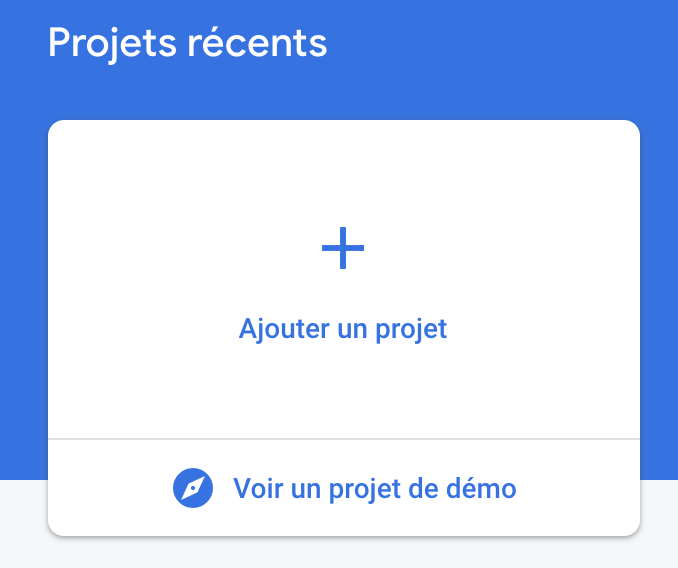
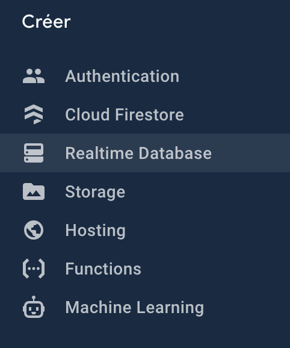
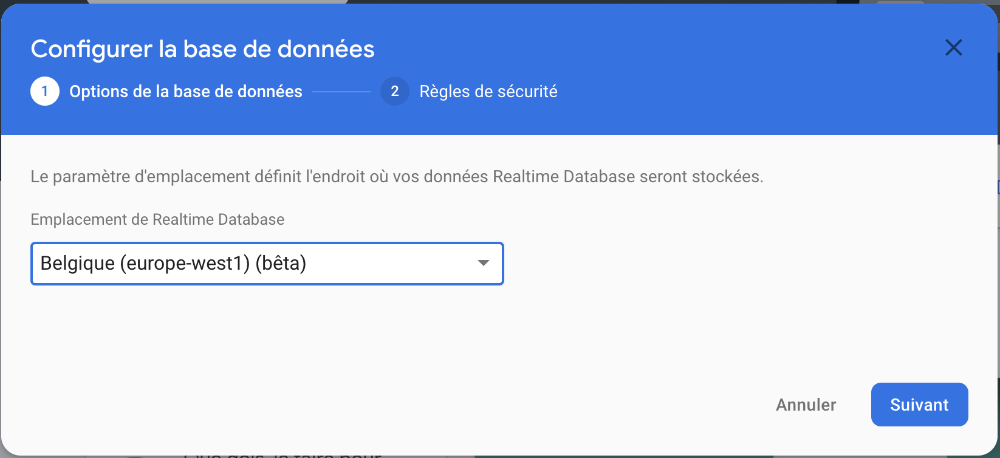
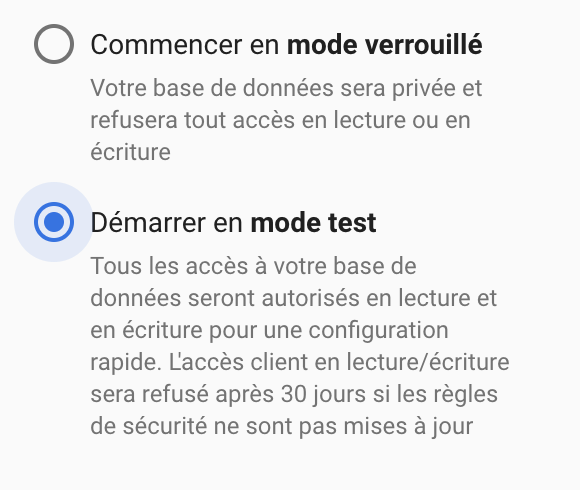
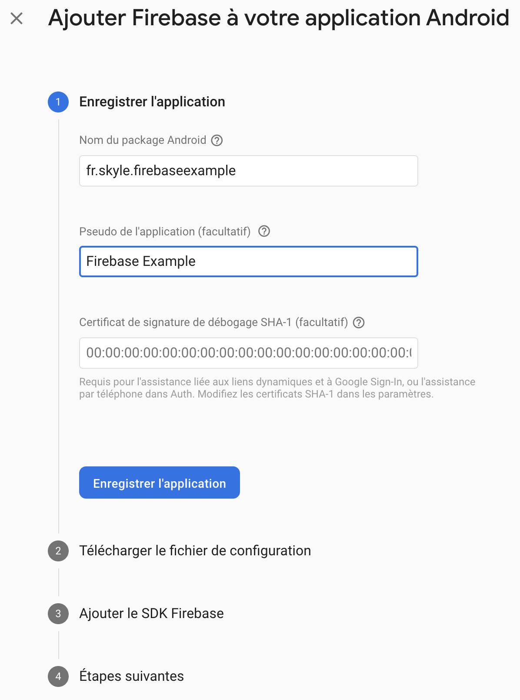
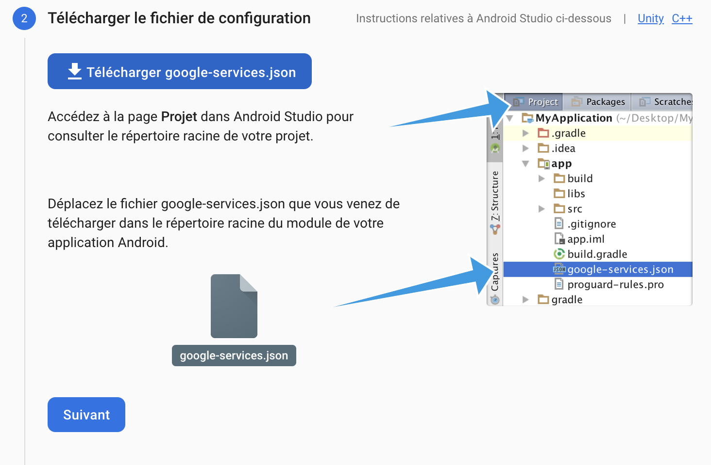

# FirebaseExample

Projet exemple pour montrer comment écouter/ajouter/supprimer des éléments dans une base de données Firebase Realtime Database.

Tuto de mise en place:

Créer le projet:

Trouver l'onglet permettant d'avoir accès à Firebase Database:

Créez une nouvelle base de données Firebase Realtime Database:

Choisissez un mode test afin de ne pase être embêté par les règles dans un premier temps:

Bravo vous avez votre base de données.

Maintenant liez la à votre application en ajoutant votre application sur Firebase :

Renseignez le package de votre projet:

Téléchargez le fichier google-services.json qui va permettre à votre application d'interragir avec le projet Firebase Realtime Database que l'on vient de créer:

Félicitations, tout est en place pour commencer à travailler ! 

Je vous invite à regarder et lancer le fichier exemple pour mieux comprendre le fonctionement de Firebase Realtime Database !
